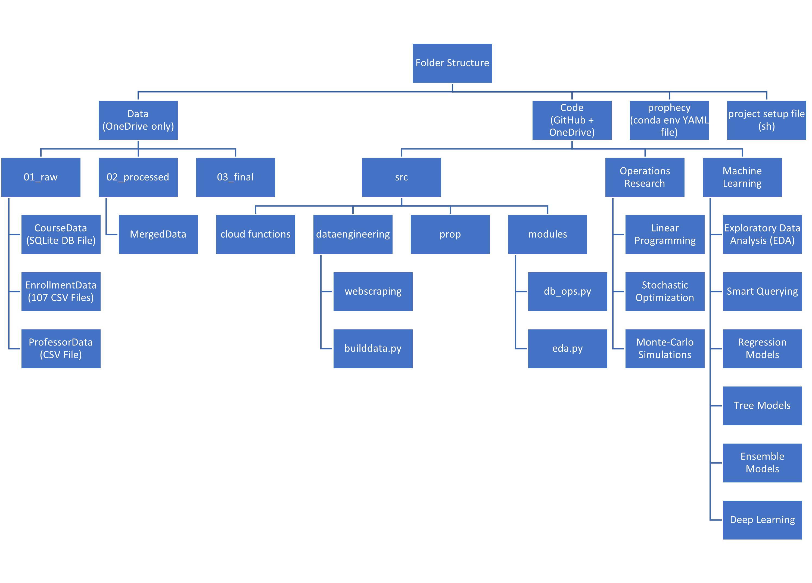

# Code Readme

## Coding Practices

Please maintain the following coding practices:

1. Use relative paths for referencing files
   1. At the start of the code, specify the source folder as follow:

      ```python
      import os
      src = os.path.join("..", "..")

      # here, 2 ".." means moving 2 folders up to locate the source folder.
      ```
   2. Later, all the files should be located by specifying relative path from source as follow:

      ```python
      file_path = os.path.join( "Data", "02processed", "merged.csv" )
      ```
   3. Why bother with these?

      1. https://scresat.github.io/navigation/Python/14.+File+names+and+Absolute-Relative+file+paths.html
      2. https://www.btelligent.com/en/blog/best-practice-working-with-paths-in-python-part-1-2/
2. Always start the code with importing modules.
   1. DO NOT IMPORT MODULES IN BETWEEN THE CODE.
   2. Knowing about all the required modules in advance will be of great help, when working in a group, trust me.

## scripts

### buildData.py

To build the dataset, run the `Code/buildData.py` file. The buildData file will perform the following steps:

1. Import the raw data in various formats.
2. Process the raw data
   1. Rename the columns
   2. Extracting Features from columns
   3. Mitigate missing values/garbage data.
   4. Merge the datasets to form a single coherent dataset.
   5. Reset index, Create surrogate keys to identify each record in the newly merged dataset.
   6. Change Data-types
   7. Reorder columns
3. Export the merged data
   1. CSV File
   2. SQLite Database (Not-normalized)
   3. Pickle File (Pandas Dataframe)
4. Normalize the data
   1. SQLite Database (Normalized)
   2. SQLite Database (Normalized)

### db_ops.py

To connect to SQLite Database and run queries. To use db_ops module:

1. Connect to the SQLite Database

   ```python
   db_enrollment = ConnectDB( os.path.join("..", "..", "Data", "02_processed", "enrollment4EDA.db") )
   ```
2. Run Queries on the Database

   ```
   db_enrollment.run_query( query = """
   	SELECT *
   	FROM enrollment4EDA
   	WHERE crs_dept = ""
   """)
   ```
3. Commit changes to the Database

## Code Structure

The code is organized in the following manner:



### src

The `00Misc` Folder contains all the necessary python modules, required to automate various aspects of the project. Some of the modules are as follows:

* db_ops.py
  * For working with SQLite Databases
  * Provides concurrent access to same database.
    * If you have multiple files using same db, you will not face the db locked isssue, as long as you are using this file.
    * If you have multiple users accessing the same db, it will allow con-current querying up to some degree (PLEASE DON"T DO THAT).
* file_paths.py
  * For working with the relative referencing.
  * For simplifying the file referencing process.
  * For making sure the code works on different OS be it (Windows, Linux, Mac)

### 01DataEngineering Folder

The `01_DataEngineering` Folder contains the scripts to automatically process the raw data, and store the outputs to the `Data/02processed` folder while in the development process. Once the development has been completed, the ouputs from these scripts will be stored to `Data/03final` folder in the deployment phase.

### 02MachineLearning Folder

The `02MachineLearning` Folder contains all the code for various analytics performed on the processed data. Each technique will be stored in a separate folder with names that describe the process and the author as well. For Example: `Code/02MachineLearning/EDA/EDA_Sagar` will store the Exploratory Data Analytics performed by Sagar. The folder will store the Jupyter Notebooks as well as the exported models, and plots. Some of these data will be pushed to `Data/03final` if it contains sensitive information.

### 03_OperationsResearch Folder

The `03OpeationsResearch` Folder contains all the code for performing Operations Research / Linear Optimizations / Monte-Carlo Simulations and related analytics.
